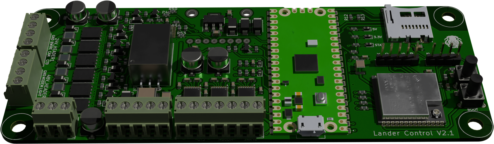

# Lander Control Board for the Inkfish Hadal Exploration System

This repository contains firmware source code and hardware design files for the Lander Control Board used by the Inkfish Hadal Exploration System.

The Lander Control Board is responsible for switching power to the lander's peripherals, including a CTD, acoustic modem, camera, and lights. The board logs CTD data and responds to commands received via the acoustic modem.

The Lander Control Board is a motherboard for a [Raspberry Pi Pico][Pico]. A secondary microcontroller, an [Espressif ESP32-C6-WROOM-1U][ESP32], adds Wi-Fi capabilities. Timekeeping is assisted by an external GPS receiver along with an [Adafruit DS3231 Precision Real-Time Clock Breakout][RTC].

The firmware is written in [CircuitPython][] in order to be easily modifiable in the field and for compatibility with future microcontrollers. Data will be logged in the [MCAP][] file format.

[CircuitPython]: https://circuitpython.org/
[ESP32]: https://www.espressif.com/en/products/socs/esp32-c6
[MCAP]: https://mcap.dev/
[Pico]: https://www.raspberrypi.com/products/raspberry-pi-pico/
[RTC]: https://www.adafruit.com/product/3013
